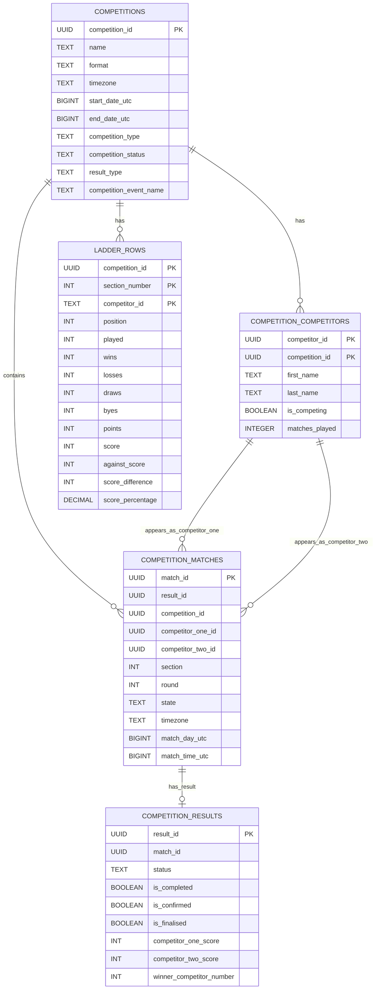

# Silver Schema ER Diagram

All entities are in the `silver` schema. Relationships and cardinalities are inferred from the SQL definitions and refresh logic; some FKs are implicit (not enforced in DDL).

## Notes and Assumptions

- COMPETITION_MATCHES.competition_id, result_id, competitor_one_id, competitor_two_id are nullable in DDL; cardinalities above reflect intended semantics from refresh logic.
- COMPETITION_RESULTS.match_id and COMPETITION_MATCHES.result_id indicate a conceptual 1:1 relationship, but either side may be null depending on source data timing.
- LADDER_ROWS.competitor_id is TEXT (not UUID) per source payload; it is not directly linked to COMPETITION_COMPETITORS.competitor_id. Use competition_id to group ladder rows within competitions.
- COMPETITIONS table now includes competition_event_name from CompetitionEvent objects in the competition endpoint.
- LADDER_ROWS table has been normalized - competition metadata (name, status, dates, type, format) and player_name removed as they're available via JOIN to COMPETITIONS and COMPETITION_COMPETITORS tables respectively.
- Timestamps are stored as BIGINT UTC epoch values for date/time fields and TIMESTAMPTZ for source event metadata.

## How to Render

- Many Markdown renderers with Mermaid support will render this automatically. If needed, use the Mermaid Live Editor to preview the diagram.
